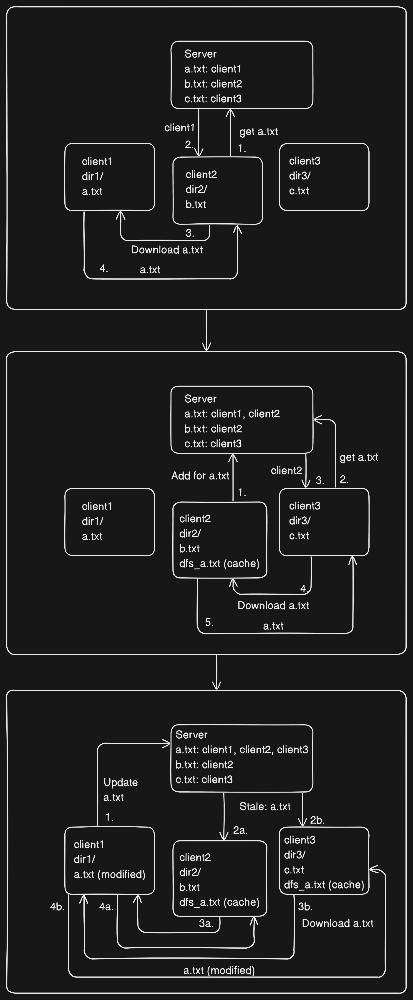

# Py-Dist-FS

## A simple distributed file system made using Python and gRPC

This is a primitive distributed file system made using Python and gRPC.

## Features
- Clients mount directories from their local FS and make it accessible to all other clients.
- A thin server that maintains metadata about clients and files.
- Clients transparently access files hosted by itself and other clients.
- Files from other clients can be cached by clients that have previously accessed the file.
- These clients can also serve the file to other clients, relying not just on the original client.
- Changes in file are propagated by marking cached copies as stale by the server.


## Limitations
- Only mounts files that are in the directory, does not recursively read the directories.
- Only works with text files.
- Error handling is absent.
- Stale copy of file could be served, if the client hasn't notified for changes in file.
- Clients directly download the file, when cache is marked stale.
- File names should be globally unique.


## Usage
### Setup
```
> virtualenv venv
> source venv/bin/activate
> pip install -r requirements.txt
```
### Run server
```
> cd package/
> python3 server.py # Starts the server
```
### Run client(s)
```
> cd package/
> python3 client.py client1 ./test-dir/client1 9001 # Change name, path, port as convinience
```

## Diagrams
